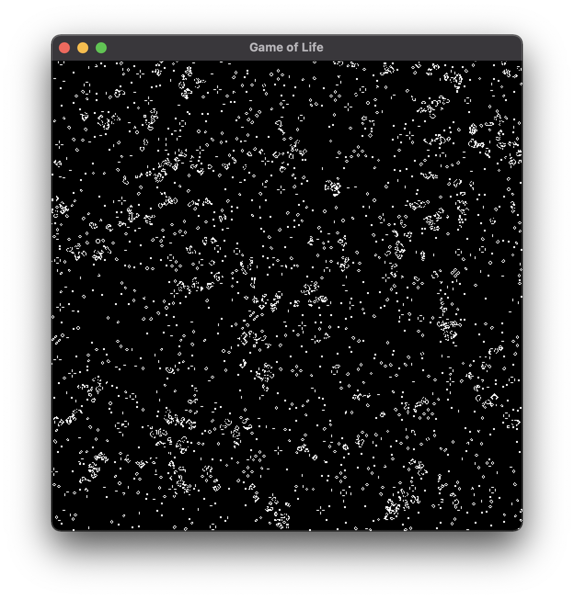

# Game of Life in Swift/Metal

```
make
```

### should work on either x86_64 or M1

```
metal-game % ./gameoflife
Metal device: <MTLIGAccelDevice: 0x7fd1791a5000>
    name = Intel(R) Iris(TM) Plus Graphics
```


